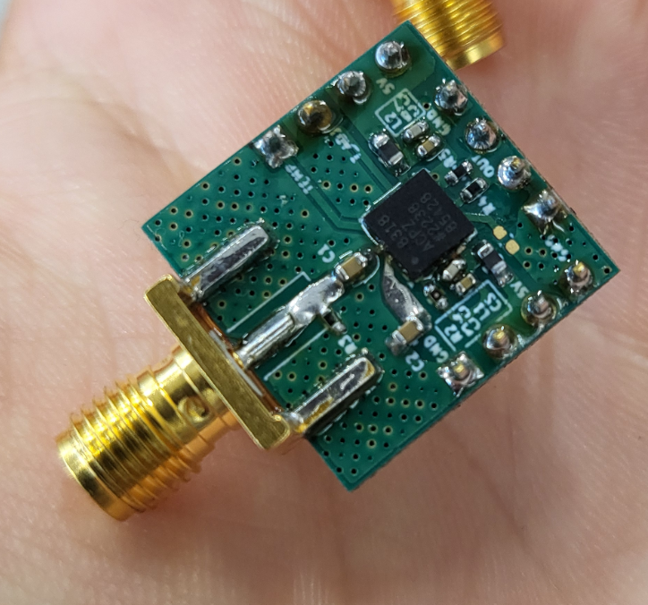

# 🛰️ RF Specialist

**`RF Specialist (PCB Design / Simulations / Measurements / Coding When Necessary)`**

I am an electronics engineer with a focus on high-frequency circuit design. My work involves designing and measuring antennas, amplifiers, filters, and the entire RF front-end. I believe that robust hardware design minimizes the need for complex software fixes — which is fortunate, since coding isn’t always my strong suit.

---

### 🧰 Tools and Technologies

 

#

### 📡 Featured Projects

<table>
  <tr>
    <!-- Projekt 1 -->
    <td align="center" style="padding: 10px;">
      
      
<strong>ADF4350 RF Generator</strong>

    </td>
    <!-- Projekt 2 -->
    <td align="center" style="padding: 10px;">
      
      
<strong>Power meter</strong>

    </td>
    <!-- Projekt 3 -->
    <td align="center" style="padding: 10px;">
      
      
<strong>RF detektor based on AD8318</strong>

    </td>
  </tr>
</table>

<table>
  <tr>
    <!-- Projekt 1 -->
    <td align="center" style="padding: 10px;">
      
      
<strong>LNA for 1420 MHz hydrogen line</strong>

    </td>
  </tr>
</table>

